<!-- icons  -->
[1.1]: https://img.shields.io/badge/GitHub-100000?style=for-the-badge&logo=github&logoColor=white
[2.1]: https://img.shields.io/badge/LinkedIn-0077B5?style=for-the-badge&logo=linkedin&logoColor=white
[3.1]: https://img.shields.io/badge/Medium-12100E?style=for-the-badge&logo=medium&logoColor=white
[4.1]: https://img.shields.io/badge/Twitter-1DA1F2?style=for-the-badge&logo=twitter&logoColor=white

<!-- links to your social media accounts -->
[1]: https://github.com/produdez
[2]: https://www.linkedin.com/in/produdez/
[3]: https://medium.com/@produde
[4]: https://twitter.com/_Produde_

# Smart Food Court Android Application System

<p align="center">
    
</p>

**Description:**

An android application for user to buy food easily at food stalls and for manager and employees to manage their work flow as well as incoming orders.

Full project report could be seen [Here](https://www.overleaf.com/read/xzpfstkwbvym)

## General Information

- Allow user to order food anywhere and go pickup onsite, with notification on order completion
- Employees have info on queued orders, stock managements
- Manager can edit stall's menu, manage old/new staffs, add discount events
- The admin can manage authentication and add/remove store to the whole system, and also see many statistics on the whole site.

## Technologies Used

- Firebase database
- Firebase authentication
- Flutter (Dart)
- No backend

## Features

1. View stores, menu, place order
   |Vendor| Add | Place | Noti Ready |
   |---|---|---|---|
    |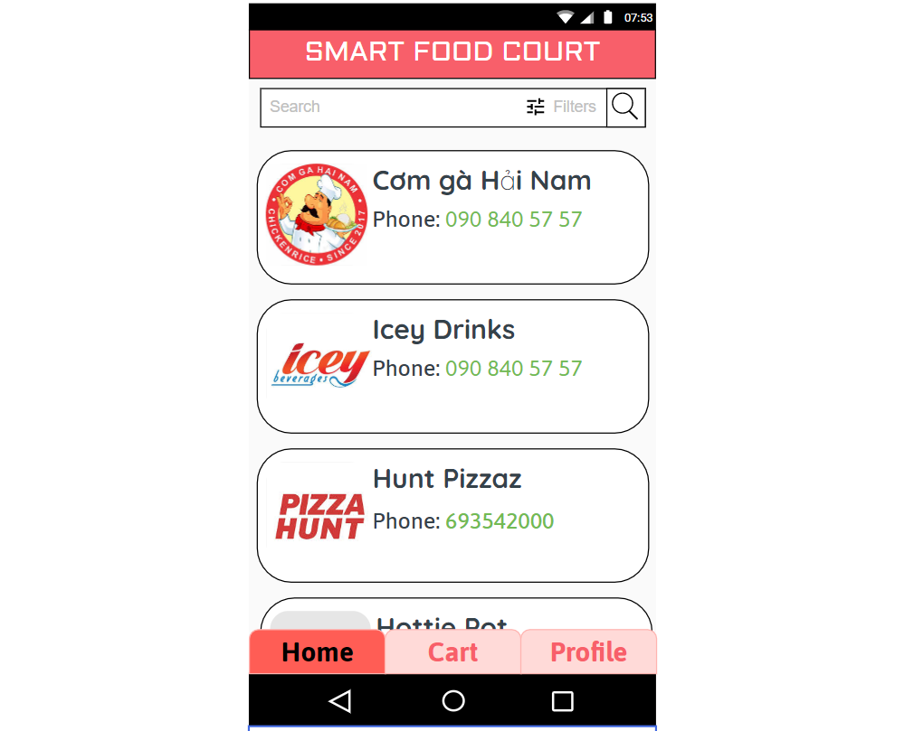|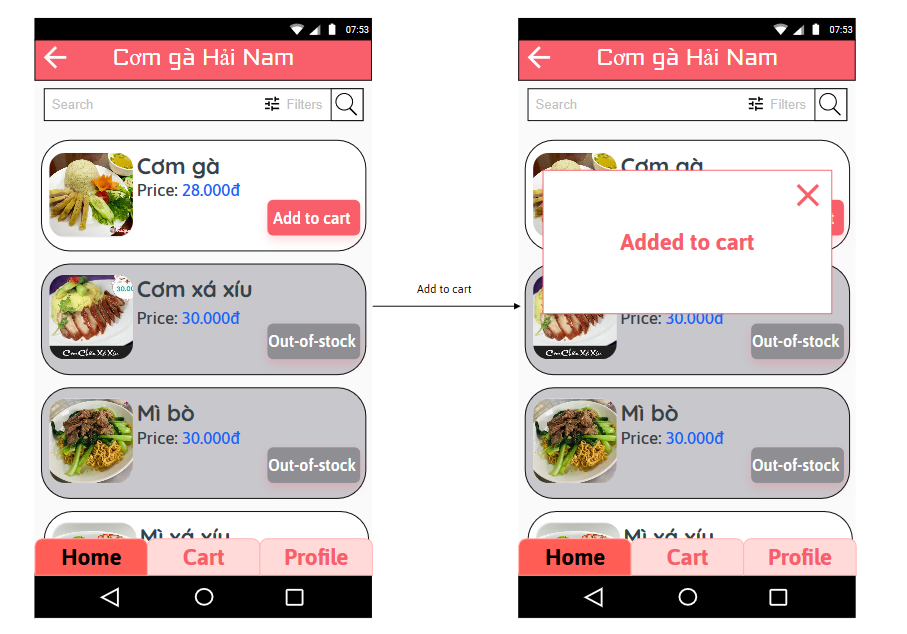|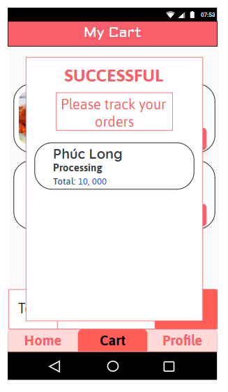|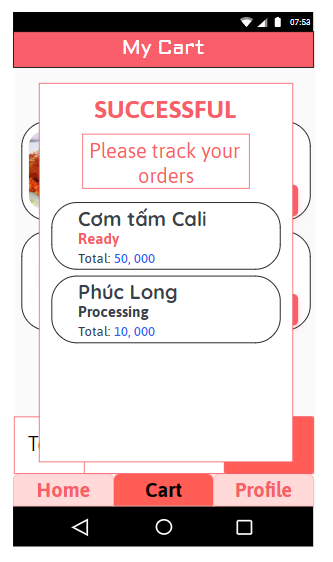|
2. Staff management
    | Show | Add | Edit |
    |---|---|---|
    |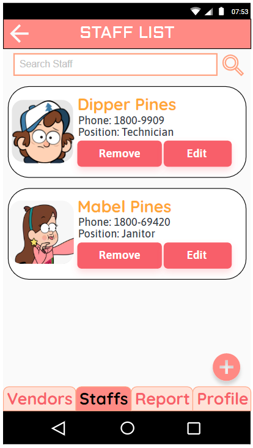|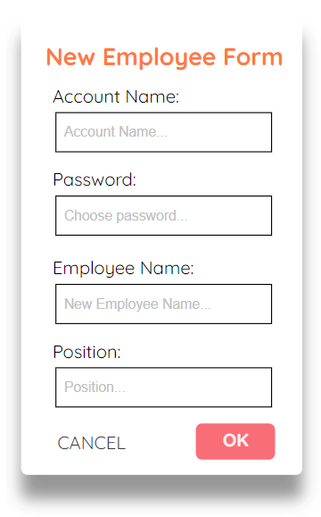|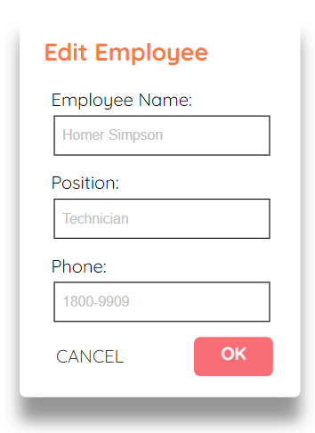|
3. View reports
    | Stall Report | Whole site report |
   |---|---|
    |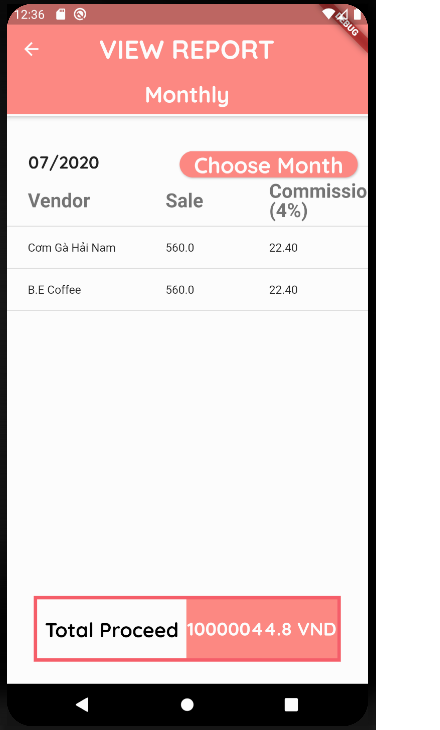|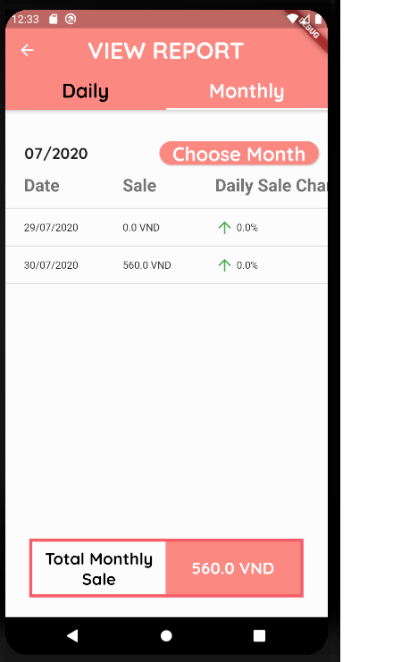|
4. Search and filter

   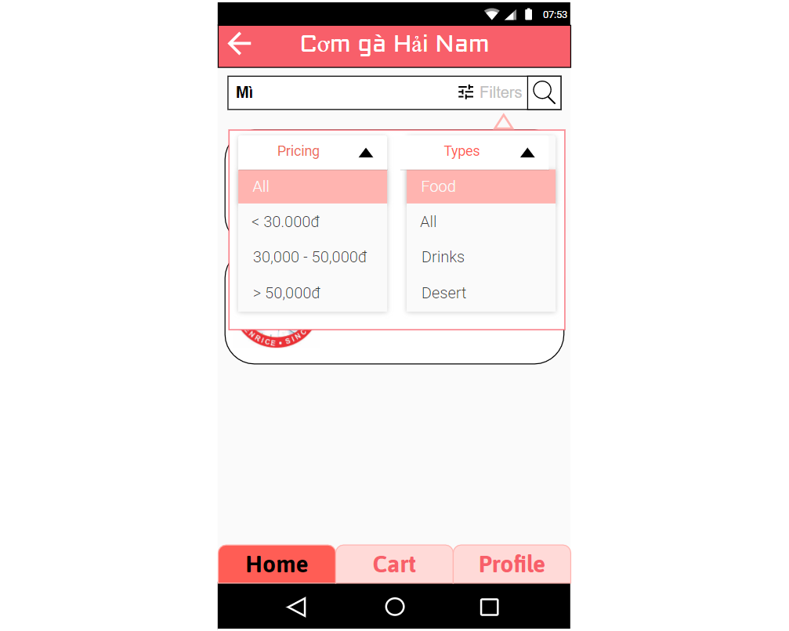
5. View and finish order

    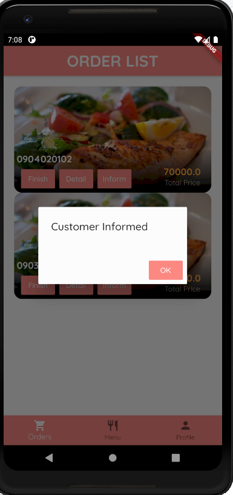

## Setup

Requirements and Installations:

1. Have flutter installed
2. Use android studio or vscode (or any android dev environment)
3. Install dependencies

    ```[bash]

    # Install dependencies
    $ flutter pub get
    ```

## Usage

1. Run

## Future Improvements

- Sync UI design
- Improve flow and logic of viewing, finishing and order
- Consider move code to backend
- Better UI overall

## Acknowledgements

- Many thanks to [The Net Ninja](https://www.youtube.com/c/TheNetNinja) for his basic Flutter tutorial.

## Contact

Created by [@produdez](https://github.com/produdez) - feel free to contact me or follow my blog on medium ❤️!

<!-- [![alt text][1.1]][1] -->
[![alt text][2.1]][2]
[![alt text][3.1]][3]
[![alt text][4.1]][4]
